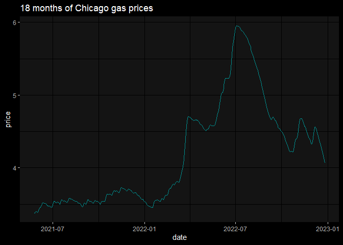

README
================
fth

## gasify

gasify is an experimental pkg, PoC for image processing. The tool itself
retrieves PNG images from a 3rd party website, these images are time
series charts of daily gas prices. The main gasify function
gasify::get_gas() converts the images into pixels, and scales based on
axes, converting PNGs into tabular pricing data.

## An Example

``` r
devtools::install_github('frankiethull/gasify')
```

    Skipping install of 'gasify' from a github remote, the SHA1 (dd7e31a5) has not changed since last install.
      Use `force = TRUE` to force installation

``` r
library(gasify)
library(ggplot2)
```

    Warning: package 'ggplot2' was built under R version 4.2.1

``` r
library(ggdark)
```

    Warning: package 'ggdark' was built under R version 4.2.2

``` r
library(dplyr)
```

    Warning: package 'dplyr' was built under R version 4.2.1


    Attaching package: 'dplyr'

    The following objects are masked from 'package:stats':

        filter, lag

    The following objects are masked from 'package:base':

        intersect, setdiff, setequal, union

#### areas

``` r
# a dataframe of the URL area names and IDs
gasify::area_options |> head()
```

           area_name       area_param
    1    USA Average    USA%20Average
    2 Canada Average Canada%20Average
    3 Abbotsford, BC       Abbotsford
    4      Akron, OH            Akron
    5    Alabama, AL          Alabama
    6     Alaska, AK           Alaska

#### periods (months)

``` r
# a vector of the period options
gasify::period_options
```

     [1]   1   3   6   9  12  18  24  36  48  60  72  84  96 108 120

#### get data & visualize

``` r
df <- gasify::get_gas()

df |>
  ggplot() + 
  geom_line(aes(x = date, y = price), color = "darkcyan") + 
  dark_mode() + 
  labs(
    title = "18 months of Chicago gas prices"
  )
```

    Inverted geom defaults of fill and color/colour.
    To change them back, use invert_geom_defaults().


